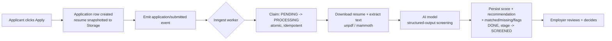

# TalentScreen

**AI-assisted resume screening that keeps a human in the loop.**

A full-stack job board and applicant tracking system. Applicants apply with a resume; an AI screens each one against the job's requirements and produces an explainable match score; employers review candidates ranked by that score and move them through a hiring pipeline. The AI advises - it never decides.

- **Live demo:** https://talent-screen.vercel.app
- **Stack:** Next.js 16 (App Router, RSC) - React 19 - TypeScript - Tailwind v4 - Supabase - Inngest - Anthropic - Resend

> Portfolio project. Build log in [PROGRESS.md](./PROGRESS.md); the full decision log (with reasons) is in [DECISIONS.md](./DECISIONS.md).

### Demo accounts

Sign in to explore both sides without registering (or create your own). Password for all: `Demo!Screen2026`

| Role | Email |
| --- | --- |
| Employer - Nimbus Labs (12 open roles, pre-screened applicants) | `recruiter@talentscreen.dev` |
| Job seeker - Ada Reyes (applications across stages) | `ada.demo@talentscreen.dev` |

## Responsible AI: human-in-the-loop by design

The screening AI is a **decision-support tool, not the decision-maker** - this is the central design constraint, not an afterthought:

- It produces a 0-100 match score, a STRONG/MODERATE/WEAK recommendation, a short summary, and explicit **matched / missing / flagged** lists - all grounded in the resume and **persisted for auditability**.
- It **never auto-rejects**. On success it moves a candidate to `SCREENED` and stops; a person makes every accept/reject call by moving them through the pipeline.
- The prompt instructs the model to **judge only on relevance to the stated requirements** and to ignore name, gender, age, nationality, and other protected characteristics.
- Output is constrained with **structured outputs** (a JSON schema) and re-validated server-side, so the employer always sees a consistent, explainable result rather than opaque prose.

## Features

- **Auth and roles** (employer vs. applicant) with Postgres Row Level Security as the security boundary.
- **Employers:** post, edit, close/reopen, and expire jobs.
- **Applicants:** upload a resume (PDF/DOCX), apply in one click, and track each application's stage + screening status.
- **AI screening pipeline:** runs in the background on apply - downloads the resume, extracts its text, calls the AI, and persists an explainable score.
- **Hiring pipeline:** per-job applicant table (sortable recommended-first, filterable by stage), a drag-and-drop Kanban board, and a candidate detail view with an inline resume preview, the AI breakdown, stage controls, and a manual re-screen.
- **Transactional email** (Resend): application-received and stage-change notifications.

## How the AI screening works

Screening is a background job so the apply request stays fast and the work is retryable and idempotent.



- **Claim step** does an atomic `PENDING|ERROR -> PROCESSING` update, so a duplicate or retried event can't double-process.
- **Retries** with backoff are built in; on exhaustion the row is set to `ERROR` and surfaced in the UI.
- The worker runs on the **Node runtime** with the Supabase **service role** (it bypasses RLS deliberately, behind a signed Inngest endpoint).

## Tech stack

| Area | Choice |
| --- | --- |
| Framework | Next.js 16 (App Router, React Server Components, Server Actions, Turbopack) |
| Language / UI | TypeScript, React 19, Tailwind CSS v4 |
| Data / auth / files | Supabase (Postgres, Auth, Storage) with Row Level Security |
| Background jobs | Inngest (retries, concurrency, idempotency, dashboard) |
| AI | Anthropic API with structured outputs |
| Resume parsing | `unpdf` (PDF) + `mammoth` (DOCX) |
| Drag-and-drop | `@dnd-kit/core` |
| Email | Resend |
| Hosting | Vercel |

## Local development

**Prerequisites:** Node 22+ (`.nvmrc` pins 22), and a Supabase project. API keys for Anthropic (and optionally Resend) to exercise screening and email.

```bash
# 1. Install
npm install

# 2. Configure environment
cp .env.example .env.local
# then fill in the values (see the table below)

# 3. Database
#    Run the SQL files in supabase/migrations/ in order (Supabase SQL editor
#    or `supabase db push`), which also creates the private `resumes` bucket.

# 4. Run the app
npm run dev                 # http://localhost:3000

# 5. Run the background-jobs dev server (separate terminal) for screening/email
npx inngest-cli@latest dev -u http://localhost:3000/api/inngest

# 6. (Optional) Seed demo data: an employer + a dozen jobs + pre-screened applicants
node --env-file=.env.local scripts/seed.mjs
```

### Environment variables

| Variable | Required | Purpose |
| --- | --- | --- |
| `NEXT_PUBLIC_SUPABASE_URL` | yes | Supabase project URL |
| `NEXT_PUBLIC_SUPABASE_ANON_KEY` | yes | Supabase publishable/anon key |
| `SUPABASE_SERVICE_ROLE_KEY` | yes | Server-only; signed URLs + the screening worker |
| `ANTHROPIC_API_KEY` | for screening | Anthropic API key |
| `INNGEST_DEV` | local | Set to `1` for the local Inngest dev server |
| `INNGEST_EVENT_KEY` / `INNGEST_SIGNING_KEY` | prod | Injected by the Inngest Vercel integration |
| `RESEND_API_KEY` | for email | Resend key; emails no-op if unset |
| `RESEND_FROM` | for email | Verified sender, e.g. `"TalentScreen <you@domain.com>"` |
| `NEXT_PUBLIC_SITE_URL` | for email links | Public base URL used in email links |
| `CRON_SECRET` | keep-alive | Gates the `/api/health` keep-alive ping |

> Without `ANTHROPIC_API_KEY` / `RESEND_API_KEY`, the app still runs - the screening and email steps degrade gracefully (screening errors are surfaced; emails are skipped).

## Screenshots

_Add captures to `docs/screenshots/` (landing, employer pipeline board, candidate detail with AI breakdown). The live demo above is the quickest way to see it in action._

## Scripts

```bash
npm run dev          # dev server (Turbopack)
npm run build        # production build
npm run typecheck    # tsc --noEmit
npm run lint         # eslint
npm run format       # prettier --write
```
