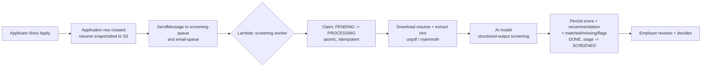

# TalentScreen

**AI-assisted resume screening that keeps a human in the loop.**

A full-stack job board and applicant tracking system. Applicants apply with a resume; an AI screens each one against the job's requirements and produces an explainable match score; employers review candidates ranked by that score and move them through a hiring pipeline. The AI advises - it never decides.

- **Live demo:** https://talent-screen.vercel.app
- **Stack:** Next.js 16 (App Router, RSC) - React 19 - TypeScript - Tailwind v4 - Neon Postgres - AWS (Cognito, S3, SQS, Lambda, Terraform) - Anthropic - Resend

> Portfolio project. The end-to-end flow (and how the SQS + Lambda workers fit in) is documented in [docs/ARCHITECTURE.md](./docs/ARCHITECTURE.md).

### Demo accounts

Sign in to explore both sides without registering (or create your own). Password for all: `Demo!Screen2026`

| Role | Email |
| --- | --- |
| Employer - Nimbus Labs (12 open roles, pre-screened applicants) | `recruiter@talentscreen.dev` |
| Job seeker - Ada Reyes (applications across stages) | `ada.demo@talentscreen.dev` |

## Responsible AI: human-in-the-loop by design

The screening AI is a **decision-support tool, not the decision-maker** - this is the central design constraint, not an afterthought:

- It produces a 0-100 match score, a STRONG/MODERATE/WEAK recommendation, a short summary, and explicit **matched / missing / flagged** lists - all grounded in the resume and **persisted for auditability**.
- It **never auto-rejects**. On success it moves a candidate to `SCREENED` and stops; a person makes every accept/reject call by moving them through the pipeline.
- The prompt instructs the model to **judge only on relevance to the stated requirements** and to ignore name, gender, age, nationality, and other protected characteristics.
- Output is constrained with **structured outputs** (a JSON schema) and re-validated server-side, so the employer always sees a consistent, explainable result rather than opaque prose.

## Features

- **Auth and roles** (employer vs. applicant) via AWS Cognito, with Postgres Row Level Security as the security boundary.
- **Employers:** post, edit, close/reopen, and expire jobs.
- **Applicants:** upload a resume (PDF/DOCX), apply in one click, and track each application's stage + screening status.
- **AI screening pipeline:** runs in the background on apply - downloads the resume, extracts its text, calls the AI, and persists an explainable score.
- **Hiring pipeline:** per-job applicant table (sortable recommended-first, filterable by stage), a drag-and-drop Kanban board, and a candidate detail view with an inline resume preview, the AI breakdown, stage controls, and a manual re-screen.
- **Transactional email** (Resend): an application-received confirmation, plus hiring emails an employer composes and sends deliberately.

## How the AI screening works

Screening is a background job so the apply request stays fast and the work is retryable and idempotent.


```mermaid
flowchart LR
  A[Applicant clicks Apply] --> B[Application row created<br/>resume snapshotted to S3]
  B --> C[SendMessage to screening-queue<br/>and email-queue]
  C --> D{Lambda: screening worker}
  D --> E[Claim: PENDING -> PROCESSING<br/>atomic, idempotent]
  E --> F[Download resume + extract text<br/>unpdf / mammoth]
  F --> G[AI model<br/>structured-output screening]
  G --> H[Persist score + recommendation<br/>+ matched/missing/flags<br/>DONE, stage -> SCREENED]
  H --> I[Employer reviews + decides]
```

- **Claim step** does an atomic `PENDING|ERROR -> PROCESSING` update. SQS standard queues deliver at least once, so a duplicate is expected rather than exceptional; a redelivery claims nothing and exits.
- **Retries** are the SQS event source mapping's job. Unfixable input (no resume, a scanned image) marks the row `ERROR` and is deleted rather than retried; a transient failure is redelivered up to 3 times, then lands in a **dead-letter queue** with a CloudWatch alarm on it.
- **Two queues, not one fan-out.** Only the apply path writes to the email queue, so a re-screen re-scores without re-sending the applicant's confirmation email.
- The worker runs on **Lambda (Node 22)** as the database **owner role**, which bypasses RLS deliberately, reading its secrets from **SSM Parameter Store** at cold start. It reads the resume from a private **S3** bucket.

## Tech stack

| Area | Choice |
| --- | --- |
| Framework | Next.js 16 (App Router, React Server Components, Server Actions, Turbopack) |
| Language / UI | TypeScript, React 19, Tailwind CSS v4 |
| Database | Neon Postgres with Row Level Security |
| Auth | AWS Cognito (user pool, httpOnly-cookie sessions) |
| File storage | AWS S3 (private bucket, presigned POST uploads) |
| Background jobs | AWS SQS + Lambda (two queues, dead-letter queues, at-least-once with an idempotent DB claim) |
| AI | Anthropic API with structured outputs |
| Resume parsing | `unpdf` (PDF) + `mammoth` (DOCX) |
| Drag-and-drop | `@dnd-kit/core` |
| Email | Resend |
| Hosting | Vercel (app) + AWS (workers) |
| Infrastructure as code | Terraform (`infra/`) |

## Local development

**Prerequisites:** Node 22+ (`.nvmrc` pins 22), a Neon database, and the AWS stack from `infra/` (Cognito, S3, SQS, Lambda). API keys for Anthropic (and optionally Resend) to exercise screening and email.

```bash
# 1. Install
npm install

# 2. Configure environment
cp .env.example .env.local
# then fill in the values (see the table below)

# 3. Database
#    Apply the schema to a fresh Neon database:
#      psql "$DATABASE_URL_UNPOOLED" -f db/migrations/0001_init.sql
#    Then create the app_user role it grants to (see db/README.md).

# 4. Run the app
npm run dev                 # http://localhost:3000

#    With QUEUE_LOCAL=1 (see .env.example) the background workers run
#    in-process, so no second terminal and no AWS access are needed.

# 5. (Optional) Seed demo data: an employer + a dozen jobs + pre-screened applicants
node --env-file=.env.local scripts/seed.mjs
```

### Environment variables

| Variable | Required | Purpose |
| --- | --- | --- |
| `APP_DATABASE_URL` | yes | Neon, as `app_user`. **RLS applies.** All user traffic |
| `DATABASE_URL` | yes | Neon, as the owner. **RLS bypassed.** Admin paths only |
| `DATABASE_URL_UNPOOLED` | migrations | Direct endpoint, bypasses PgBouncer |
| `COGNITO_USER_POOL_ID` / `COGNITO_CLIENT_ID` / `COGNITO_CLIENT_SECRET` | yes | From `terraform output` |
| `COGNITO_HOSTED_DOMAIN` | for Google sign-in | From `terraform output cognito_hosted_domain`. Doubles as the feature flag: the Google button renders only when set |
| `RESUME_BUCKET` | yes | Private S3 bucket for resumes |
| `ANTHROPIC_API_KEY` | for screening | Anthropic API key |
| `QUEUE_LOCAL` | local | Set to `1` to run the workers in-process instead of via SQS |
| `SCREENING_QUEUE_URL` / `EMAIL_QUEUE_URL` | prod | From `terraform output` in `infra/` |
| `SQS_ACCESS_KEY_ID` / `SQS_SECRET_ACCESS_KEY` | prod | Publish-only IAM user; `sqs:SendMessage` on those two queues and nothing else. `SQS_` prefix because Lambda reserves the `AWS_` names |
| `SQS_REGION` | prod | e.g. `ap-southeast-1` |
| `RESEND_API_KEY` | for email | Resend key; emails no-op if unset |
| `RESEND_FROM` | for email | Verified sender, e.g. `"TalentScreen <you@domain.com>"` |
| `NEXT_PUBLIC_SITE_URL` | for email links | Public base URL used in email links |
| `CRON_SECRET` | optional | Gates the `/api/health` liveness endpoint |

> Without `ANTHROPIC_API_KEY` / `RESEND_API_KEY`, the app still runs - the screening and email steps degrade gracefully (screening errors are surfaced; emails are skipped).

## Screenshots

_Add captures to `docs/screenshots/` (landing, employer pipeline board, candidate detail with AI breakdown). The live demo above is the quickest way to see it in action._

## Scripts

```bash
npm run dev          # dev server (Turbopack)
npm run build        # production build
npm run typecheck    # tsc --noEmit
npm run lint         # eslint
npm run format       # prettier --write
npm run build:workers # bundle the Lambda workers, fails past Lambda's 50 MB limit
npm run check:queue  # assert only the apply path reaches the email queue
npm run check:rls    # assert RLS denies cross-tenant reads and writes
npm run check:auth   # assert Cognito sign-up/in/refresh and the role claim
npm run eval         # run the screening evals against the real model
```
