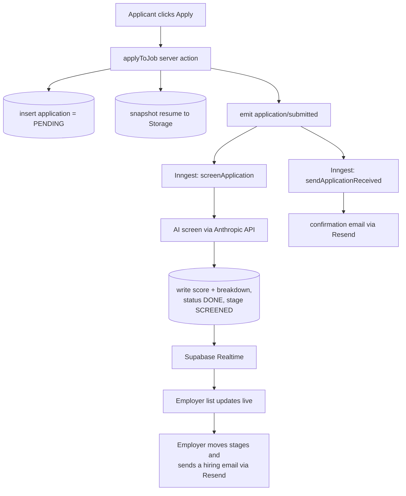

# How TalentScreen works (end to end)

A practical map of the whole flow for a developer new to the codebase. For
install + environment variables, see the [README](../README.md).

## The one-paragraph version

Employers post jobs. An applicant applies with a resume. Instead of making the
employer read every resume, an **AI screener** reads each one against the job's
requirements in the background and produces an explainable match score. The
employer reviews candidates ranked by that score and moves them through a hiring
pipeline. The AI advises - a human always makes the final call.

## The moving parts

| Piece | Role in the flow |
| --- | --- |
| **Next.js** (App Router) | The UI, Server Actions (mutations), and API routes |
| **Supabase** | Postgres database, Auth, file Storage (resumes), Row-Level Security, and Realtime |
| **Inngest** | Runs the slow / failure-prone work (screening, email) in the **background** |
| **Anthropic API** | The AI that reads a resume against a job and returns a structured assessment |
| **Resend** | Sends the transactional emails (apply confirmation, hiring updates) |

## The end-to-end flow



## Step by step

1. **Apply.** The applicant submits. The `applyToJob` server action
   (`app/applications/actions.ts`):
   - inserts an `applications` row with `screening_status = PENDING`,
   - snapshots their resume into the private `resumes` Storage bucket,
   - emits an `application/submitted` event to Inngest, then returns right away.
     The request stays fast - nobody waits for the AI.

2. **Background work (Inngest).** That single event fans out to two functions:
   - **`screenApplication`** (`lib/inngest/functions.ts`) - the core. It
     (1) atomically *claims* the row (`PENDING -> PROCESSING`, so a duplicate or
     retried event cannot double-run), (2) downloads the resume and extracts its
     text, (3) calls the AI (`lib/screening.ts`) for a structured assessment
     (score, matched, missing, flags, summary, recommendation), and (4) writes
     the results, setting `status = DONE` and `stage = SCREENED`. Retries with
     backoff are built in; on unfixable input (no resume, scanned image) it sets
     `ERROR`.
   - **`sendApplicationReceived`** (`lib/inngest/email-functions.ts`) - emails
     the applicant a "we got it" confirmation via Resend.

3. **Live review.** Because the `applications` table is published to Supabase
   Realtime, the employer's applicant list / board updates **live** as each
   screening finishes (`app/jobs/[id]/applicants/applicants-view.tsx`) - no
   refresh needed.

4. **Decide and notify.** The employer moves candidates through the pipeline and,
   when ready, composes a hiring email (advance / reject / custom) on the
   candidate page. The `sendCandidateEmail` server action
   (`app/jobs/[id]/applicants/actions.ts`) sends it via Resend and logs it to
   `application_emails`. The AI never sends anything or rejects anyone on its own.

## Why Inngest (instead of doing it inline)?

Screening is **slow and can fail**: download a file, parse it, call an LLM. If
that ran inside the apply request, the applicant would watch a spinner for
seconds and a transient error would lose the screening entirely. Inngest turns
it into a durable background job:

- **One event, many reactions.** `application/submitted` triggers both screening
  and the confirmation email, fully decoupled from the web request.
- **Retries** with backoff handle transient failures (rate limits, network blips).
- **Idempotency.** The atomic claim step means re-delivered or duplicate events
  never double-process - which also makes the manual "re-screen" button safe.
- **Observability.** Every run is visible in the Inngest dashboard.

Locally you run the Inngest dev server next to `next dev`:

```bash
npx inngest-cli@latest dev -u http://localhost:3000/api/inngest
```

In production, the Inngest Vercel integration injects the keys and signs every
request to the `/api/inngest` endpoint (`app/api/inngest/route.ts`), so the
worker cannot be triggered by outside callers.

## Why Resend?

All transactional email goes through Resend, wrapped in `lib/email.ts`:

- the **apply confirmation** (from the `sendApplicationReceived` Inngest
  function), and
- the **hiring emails** the employer composes (from the `sendCandidateEmail`
  server action).

If `RESEND_API_KEY` is unset, sending **no-ops with a log line** instead of
crashing, so the app runs fine in local dev without an email key. (Stage moves
do not auto-email - the employer sends deliberately, so applicants are never
spammed.)

## Where to look in the code

| Flow | File(s) |
| --- | --- |
| Apply + emit the event | `app/applications/actions.ts` |
| Inngest client + event types | `lib/inngest/client.ts` |
| Screening job | `lib/inngest/functions.ts`, `lib/screening.ts` |
| Confirmation-email job | `lib/inngest/email-functions.ts` |
| Inngest HTTP endpoint | `app/api/inngest/route.ts` |
| Email sending helper | `lib/email.ts` |
| Hiring-email action | `app/jobs/[id]/applicants/actions.ts` |
| Live applicant list | `app/jobs/[id]/applicants/applicants-view.tsx` |
| Screening evals | `evals/` (run `npm run eval`) |

## A note on security

Row-Level Security in Postgres is the real boundary, not the UI. Applicants can
only read their own applications; employers can only read applications for jobs
they own. The screening worker uses the Supabase **service role** (it bypasses
RLS on purpose) but only runs behind the signed Inngest endpoint, never from the
browser.
