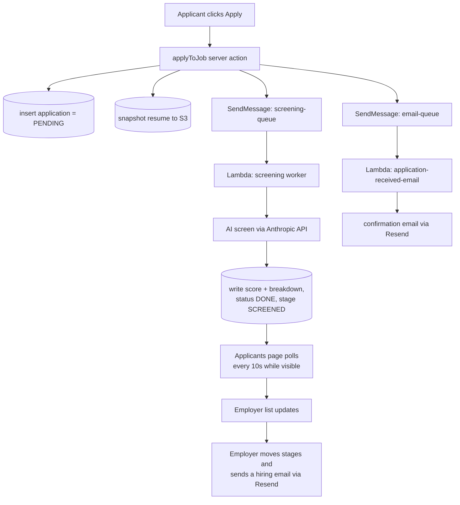

# How TalentScreen works (end to end)

A practical map of the whole flow for a developer new to the codebase. For
install + environment variables, see the [README](../README.md).

## The one-paragraph version

Employers post jobs. An applicant applies with a resume. Instead of making the
employer read every resume, an **AI screener** reads each one against the job's
requirements in the background and produces an explainable match score. The
employer reviews candidates ranked by that score and moves them through a hiring
pipeline. The AI advises - a human always makes the final call.

## The moving parts

| Piece | Role in the flow |
| --- | --- |
| **Next.js** (App Router) | The UI, Server Actions (mutations), and API routes |
| **Neon** | Postgres database, and Row-Level Security as the authorization boundary |
| **AWS Cognito** | Authentication: the user directory and JWT issuer |
| **AWS S3** | Private bucket holding resumes |
| **AWS SQS + Lambda** | Runs the slow / failure-prone work (screening, email) in the **background** |
| **Terraform** (`infra/`) | Defines the AWS half: queues, DLQs, functions, IAM, secrets |
| **Anthropic API** | The AI that reads a resume against a job and returns a structured assessment |
| **Resend** | Sends the transactional emails (apply confirmation, hiring updates) |

## The end-to-end flow

```mermaid
flowchart TD
  A[Applicant clicks Apply] --> SA[applyToJob server action]
  SA --> DB[(insert application = PENDING)]
  SA --> ST[(snapshot resume to S3)]
  SA --> Q1[SendMessage: screening-queue]
  SA --> Q2[SendMessage: email-queue]

  Q1 --> F1[Lambda: screening worker]
  Q2 --> F2[Lambda: application-received-email]

  F1 --> AI[AI screen via Anthropic API]
  AI --> R[(write score + breakdown,<br/>status DONE, stage SCREENED)]
  F2 --> EM[confirmation email via Resend]

  R --> RT[Applicants page polls<br/>every 10s while visible]
  RT --> E[Employer list updates]
  E --> DEC[Employer moves stages and<br/>sends a hiring email via Resend]
```

## Step by step

1. **Apply.** The applicant submits. The `applyToJob` server action
   (`app/applications/actions.ts`):
   - inserts an `applications` row with `screening_status = PENDING`,
   - snapshots their resume onto the application's own path in the private S3 bucket, so replacing the CV later does not rewrite what was submitted,
   - sends one message to **each** of the two SQS queues (`lib/queue.ts`), then
     returns right away. The request stays fast - nobody waits for the AI. The
     sends are best-effort: the row is already committed, so a queue outage must
     not fail the apply.

2. **Background work (Lambda).** Each queue drives its own function:
   - **`workers/screening.ts`** - the core. It
     (1) atomically *claims* the row (`PENDING -> PROCESSING`, so a duplicate or
     retried event cannot double-run), (2) downloads the resume and extracts its
     text, (3) calls the AI (`lib/screening.ts`) for a structured assessment
     (score, matched, missing, flags, summary, recommendation), and (4) writes
     the results, setting `status = DONE` and `stage = SCREENED`. Retries with
     backoff are handled by SQS; on unfixable input (no resume, scanned image) it
     sets `ERROR` and returns normally so the message is deleted rather than
     retried three times for nothing.
   - **`workers/application-received-email.ts`** - emails the applicant a
     "we got it" confirmation via Resend.

3. **Live review.** The employer's applicant list and board refresh as each
   screening finishes (`app/jobs/[id]/applicants/applicants-view.tsx`). This
   polls every 10 seconds while the tab is visible, and stops when it is not.

   That is a deliberate downgrade from Supabase Realtime, which was lost with
   Supabase. It only costs anything while someone is actually looking at the
   page, and a score appearing a few seconds late is not worth a websocket.
   Drag-and-drop already updates optimistically, so the interaction itself never
   waits for a poll.

4. **Decide and notify.** The employer moves candidates through the pipeline and,
   when ready, composes a hiring email (advance / reject / custom) on the
   candidate page. The `sendCandidateEmail` server action
   (`app/jobs/[id]/applicants/actions.ts`) sends it via Resend and logs it to
   `application_emails`. The AI never sends anything or rejects anyone on its own.

## Why a queue (instead of doing it inline)?

Screening is **slow and can fail**: download a file, parse it, call an LLM. If
that ran inside the apply request, the applicant would watch a spinner for
seconds and a transient error would lose the screening entirely. A queue turns it
into a durable background job:

- **Retries** are the SQS event source mapping's job. A transient failure is
  redelivered up to 3 times, then lands in a **dead-letter queue** with a
  CloudWatch alarm on it.
- **Idempotency.** SQS standard queues deliver *at least once*, so a duplicate is
  expected rather than exceptional. The atomic claim means a redelivery claims
  nothing and exits, which is also what makes the manual "re-screen" button safe.
- **Bounded blast radius.** Each function's IAM role can drain only its own
  queue. Neither can send to the other.

### Why two queues rather than one fan-out

The textbook answer for one event driving two consumers is SNS or EventBridge
fanning out. Two plain queues is less infrastructure and it fixes a real bug.

Under the previous Inngest setup both workers shared the single
`application/submitted` event. But `rescreenApplication` and `updateJob` re-send
that same event, so clicking **re-screen emailed the candidate "We received your
application" a second time**, and editing a job's requirements did it to every
applicant on that job at once.

Routing at the producer means only the apply path ever writes to the email queue,
so there is no guard to forget. `npm run check:queue` asserts exactly that.

### Locally

No queue, no emulator, no second terminal. With `QUEUE_LOCAL=1`, `lib/queue.ts`
invokes the worker handler in-process. This deliberately skips real queue
semantics (no redelivery, no DLQ, no concurrency cap) and is for `npm run dev`
only.

### Secrets

The workers read `DATABASE_URL`, `ANTHROPIC_API_KEY` and `RESEND_API_KEY` from
**SSM Parameter Store** at cold start, cached for the container's lifetime.
Setting them as Lambda environment variables through Terraform would write them
into `terraform.tfstate` in plaintext, and `DATABASE_URL` is the owner
connection, which bypasses RLS. Non-secrets (the bucket name, the Cognito pool
id, the site URL) are plain Lambda environment variables.

## Why Resend?

All transactional email goes through Resend, wrapped in `lib/email.ts`:

- the **apply confirmation** (from the `workers/application-received-email.ts`
  Lambda), and
- the **hiring emails** the employer composes (from the `sendCandidateEmail`
  server action).

If `RESEND_API_KEY` is unset, sending **no-ops with a log line** instead of
crashing, so the app runs fine in local dev without an email key. (Stage moves
do not auto-email - the employer sends deliberately, so applicants are never
spammed.)

## Where to look in the code

| Flow | File(s) |
| --- | --- |
| Apply + enqueue | `app/applications/actions.ts` |
| Queue publishers | `lib/queue.ts` |
| Screening worker | `workers/screening.ts`, `lib/screening.ts` |
| Confirmation-email worker | `workers/application-received-email.ts` |
| Worker secret loading | `workers/config.ts` |
| AWS infrastructure | `infra/` (see `infra/README.md`) |
| Worker bundling | `scripts/bundle-workers.mjs` |
| Queue-routing check | `scripts/check-queue-routing.ts` (`npm run check:queue`) |
| Database access + RLS context | `lib/db.ts`, `db/README.md` |
| RLS check | `scripts/check-rls.ts` (`npm run check:rls`) |
| Auth (Cognito) | `lib/cognito.ts`, `lib/session.ts`, `proxy.ts` |
| Auth check | `scripts/check-auth.ts` (`npm run check:auth`) |
| Resume storage | `lib/storage.ts` |
| Email sending helper | `lib/email.ts` |
| Hiring-email action | `app/jobs/[id]/applicants/actions.ts` |
| Live applicant list | `app/jobs/[id]/applicants/applicants-view.tsx` |
| Screening evals | `evals/` (run `npm run eval`) |

## A note on security

Row-Level Security in Postgres is the real boundary, not the UI. Applicants can
only read their own applications; employers can only read applications for jobs
they own.

There are exactly two ways to reach the database, and the difference is the
whole model. `asUser()` connects as `app_user`, for which `rolbypassrls` is
false, inside a transaction that sets `app.user_id`; every policy applies.
`asAdmin()` connects as the owner, for which it is true; every policy is
bypassed. Connecting the app as the owner - the obvious thing to do with the
connection string Neon hands you - would leave all 14 policies in place and
silently enforcing nothing.

The screening worker uses the owner connection on purpose, but runs only on
Lambda, triggered by a queue message, never from It has no HTTP endpoint at all, so there is nothing for an outside
caller to reach. The key Vercel holds for AWS can do exactly one thing:
`sqs:SendMessage` to those two queues.
